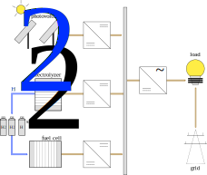

.. _lab:energysystemmodels:

Details on the energy system models
===================================

Hydrogen can be used as an energy carrier in several contexts:
power-to-power (reproduce electricity in fuel cell or gas turbine), power-to-mobility (hydrogen cars, buses, trucks,...), 
power-to-gas (injection in gas infrastructure), 
power-to-fuel (production of ammonia, methanol,...) and power-to-industry (decarbonize chemical sector). 
In each context, an energy system model is described in the following sections.

.. _lab:pvelectrolyzermodel:

Power-to-fuel
-------------

In the photovoltaic-electrolyzer model, a photovoltaic array is coupled to an electrolyzer stack through a DC-DC converter with Maximum Power Point Tracking.
The electricity produced by the photovoltaic array is used to convert water into hydrogen and oxygen.

   The photovoltaic array is connected to the electrolyzer stack through a DC-DC converter with Maximum Power Point Tracking.
   
The performance indicators of the system are the Levelized Cost Of Hydrogen (LCOH) and the produced hydrogen :math:`\dot{m}_{\mathrm{H}_2}`.
The produced hydrogen is equal to the sum of the hourly produced hydrogen:

:math:`\dot{m}_{\mathrm{H}_2} = \sum_{i=0}^{8760} \dot{m}_{\mathrm{H}_2,i}`

The LCOH presents the cost per kg of hydrogen covered:

:math:`\mathrm{LCOH} = \dfrac{ \mathrm{CAPEX}_\mathrm{a} + \mathrm{OPEX}_\mathrm{a} + R_\mathrm{c,a}   }{\sum_{i=0}^{8760} \dot{m}_{\mathrm{H}_2,i}}`,

where :math:`\mathrm{CAPEX}_\mathrm{a}` and :math:`\mathrm{OPEX}_\mathrm{a}` represents the annualized investment cost and annualized operational cost 
for the photovoltaic array, electrolyzer stack and DC-DC converter, while :math:`R_\mathrm{c,a}` represents the annualized replacement cost for the electrolyzer array.

The solar irradiance is subject to inter-annual variability.
Due to commissioning and maintenance quality, evolving market conditions and a 
significant timeframe between the design stage and investment stage, the CAPEX, OPEX, replacement cost
and interest rate are considered uncertain.
More details on the characterization of the stochastic parameters are described by Coppitters et al. :cite:`coppitters2020robust`.

.. list-table:: Stochastic space for the photovoltaic-electrolyzer system
   :widths: 50 50 50
   :header-rows: 1
   
   * - parameter
     - distribution
     - unit
	 
   * - :math:`\mathrm{sol\_irr}`
     - :math:`\mathcal{U}(90.1,109.9)` 
     - :math:`\% ~ \mathrm{of} ~ \mathrm{annual} ~ \mathrm{solar} ~ \mathrm{irradiance}`
   
   * - :math:`\mathrm{CAPEX}_\mathrm{PV}`
     - :math:`\mathcal{U}(430,780)`
     - :math:`{\large €} / \mathrm{kW}_\mathrm{p}`

   * - :math:`\mathrm{OPEX}_\mathrm{PV}`
     - :math:`\mathcal{U}(16,19)`
     - :math:`{\large €} / \mathrm{kW}_\mathrm{p} / \mathrm{year}`

   * - :math:`\mathrm{power\_tol}_\mathrm{PV}`
     - :math:`\mathcal{U}(0,0.05)`
     -
	 
   * - :math:`\mathrm{CAPEX}_\mathrm{pem}`
     - :math:`\mathcal{U}(1400,2100)`
     - :math:`{\large €} / \mathrm{kW}`

   * - :math:`\mathrm{OPEX}_\mathrm{pem}`
     - :math:`\mathcal{U}(3,5)`
     - :math:`\% ~ \mathrm{of} ~ \mathrm{CAPEX}_\mathrm{pem}`

   * - :math:`R_\mathrm{c,pem}`
     - :math:`\mathcal{U}(15,20)`
     - :math:`\% ~ \mathrm{of} ~ \mathrm{CAPEX}_\mathrm{pem}`

   * - :math:`n_\mathrm{pem}`
     - :math:`\mathcal{U}(60000,100000)`
     - :math:`h`

   * - :math:`\eta_\mathrm{pem}`
     - :math:`\mathcal{U}(0.6,0.7)`
     -

   * - :math:`\mathrm{CAPEX}_\mathrm{DC-DC}`
     - :math:`\mathcal{U}(100,200)`
     - :math:`{\large €} / \mathrm{kW}`

   * - :math:`\mathrm{OPEX}_\mathrm{DC-DC}`
     - :math:`\mathcal{U}(1,5)`
     - :math:`\% ~ \mathrm{of} ~ \mathrm{CAPEX}_\mathrm{DC-DC}`

   * - :math:`\eta_\mathrm{DC-DC}`
     - :math:`\mathcal{U}(0.90,0.95)`
     -

   * - :math:`i'`
     - :math:`\mathcal{U}(0.04,0.08)`
     -

   * - :math:`f`
     - :math:`\mathcal{U}(0.01,0.03)`
     -

.. _lab:pvh2model:

Power-to-power
--------------

The considered system is a grid-connected load, supported by a photovoltaic array and a hydrogen-based energy system. 
The grid is considered permanently available and able to cover the required power at any time of the year. 
The PV array is coupled to a DC bus bar through a DC-DC converter with Maximum Power Point Tracking. 
An electrolyzer stack with storage tank are integrated to store the excess of PV array electricity. 
A fuel cell array is implemented to produce electricity from the stored hydrogen. To transfer the DC electricity from the photovoltaic array and fuel cell array to the AC load, a DC-AC converter is connected.

.. _fig:pvh2scheme:

   The considered system includes the load connected to the grid and supported by a photovoltaic array and hydrogen-based energy system. 
   The hydrogen-based energy system (electrolyzer, fuel cell and storage tank) enable the system to store an excess of PV array electricity and to comply, up to the available energy, with the demand when the solar irradiance is insufficient.
 
To set the hierarchy between the subsystems, a typical power management strategy is implemented, which primarily aims to satisfy the demand. 
In this strategy, excess PV power (i.e. remaining PV power after complying with the power required by the load) is supplied to the electrolyzer stack. 
When the hydrogen tank is full, or when the surplus power lies outside the electrolyzer array operating range, 
the surplus energy is sold to the grid at the wholesale electricity price. In the opposite case, when the PV array does not cover the demand, the remaining demand is covered by the fuel cell array, 
if sufficient stored hydrogen is available and if the required power lies within the operating boundaries of the fuel cell array. If not, the grid covers the remaining demand.
The price for buying electricity from the grid depends on the wholesale electricity price and the fraction of the wholesale electricity price to the retail electricity price elec_cost_ratio.

To evaluate the techno-economic performance of the system, 
the Levelized Cost Of Electricity (LCOE) is selected. 
The LCOE reflects the system cost per unit of electricity covered:

:math:`\mathrm{LCOE} = \dfrac{\mathrm{CAPEX}_\mathrm{a} + \mathrm{OPEX}_\mathrm{a} + R_\mathrm{c,a} +G_\mathrm{c,a} - G_\mathrm{s,a}}{ \sum_{i=0}^{8760} P_\mathrm{demand}}`.

To determine the system cost, the annualized investment cost of all components :math:`\mathrm{CAPEX}_\mathrm{a}`, annualized operational cost :math:`\mathrm{OPEX}_\mathrm{a}`, annualized replacement cost :math:`R_\mathrm{c,a}`, 
grid electricity cost :math:`G_\mathrm{c,a}` and the gain from selling excess electricity :math:`G_\mathrm{s,a}` are evaluated.
:math:`\sum_{i=0}^{8760} P_\mathrm{demand}` represents the total electricity demand.  

To indicate the fraction of the load that is covered by the photovoltaic array and hydrogen-based system,
the Self-Sufficiency Ratio (SSR) is quantified as a secondary performance indicator:

:math:`\mathrm{SSR} = 1 - \dfrac{\sum_{i=0}^{8760} P_\mathrm{grid}}{\sum_{i=0}^{8760} P_\mathrm{demand}}`,

where :math:`\sum_{i=0}^{8760} P_\mathrm{grid}` is the demand covered by the grid. 
The SSR is an important factor for adopters of HRES, as it illustrates the resilience against large electricity price increases and the protection against power cuts, 
which are more likely in the future. Moreover, reaching a significant SSR threshold is beneficial for grid operators, as it reduces the simultaneous power extraction from the grid 
and therefore reduces the risk of black-outs.

The system model is subject to techno-economic uncertainty, which affect both the LCOE and SSR.
Additionally, inter-annual variability is present on the electricity demand, solar irradiance and ambient temperature~\cite{Mavromatidis2018}.
From an economic point of view, the system is subject to commissioning and maintenance quality, which affects the operating and maintenance cost, 
uncertain replacement cost due to evolving market conditions and a highly-uncertain wholesale electricity price due to an evolving energy mix, 
improved energy efficiency and increased electrification of fossil-based energy sectors.
A change in the finance type of the project and a significant timeframe between the design stage and investment stage, 
which increases the possibility for the market conditions to change between the stages, implies uncertainty on the interest rate and investment costs. 
Therefore, the CAPEX and OPEX for each component (i.e. photovoltaic array, electrolyzer stack, hydrogen storage tank, fuel cell stack, DC-DC converters and DC-AC inverter) 
are considered uncertain. In the case that the expected lifetime does not exceed the system lifetime, the lifetime and replacement cost are considered uncertain as well.
More details on the characterization of the stochastic parameters are described by Coppitters et al. [1].

.. list-table:: Stochastic space for the photovoltaic-hydrogen system
   :widths: 50 50 50
   :header-rows: 1
   
   * - parameter
     - distribution
     - unit

   * - :math:`\mathrm{sol\_irr}`
     - :math:`\mathcal{U}(0.901,1.099)` 
     - :math:`\% ~ \mathrm{of} ~ \mathrm{annual} ~ \mathrm{solar} ~ \mathrm{irradiance}`
   
   * - :math:`\mathrm{load\_elec}`
     - :math:`\mathcal{U}(3.20,4.32)` 
     - :math:`\mathrm{MW}/ \mathrm{year}`

   * - :math:`\mathrm{elec\_cost}`
     - :math:`\mathcal{U}(46,97)`
     - :math:`{\large €} / \mathrm{MWh}`

   * - :math:`\mathrm{elec\_cost\_ratio}`
     - :math:`\mathcal{U}(0.2,0.4)`
     -

   * - :math:`\mathrm{CAPEX}_\mathrm{PV}`
     - :math:`\mathcal{U}(430,780)`
     - :math:`{\large €} / \mathrm{kW}_\mathrm{p}`

   * - :math:`\mathrm{OPEX}_\mathrm{PV}`
     - :math:`\mathcal{U}(16,19)`
     - :math:`{\large €} / \mathrm{kW}_\mathrm{p}`

   * - :math:`\mathrm{power\_tol}_\mathrm{PV}`
     - :math:`\mathcal{U}(0,0.05)`
     -
	 
   * - :math:`\mathrm{CAPEX}_\mathrm{pem}`
     - :math:`\mathcal{U}(1400,2100)`
     - :math:`{\large €} / \mathrm{kW}`

   * - :math:`\mathrm{OPEX}_\mathrm{pem}`
     - :math:`\mathcal{U}(3,5)`
     - :math:`\% ~ \mathrm{of} ~ \mathrm{CAPEX}_\mathrm{pem}`

   * - :math:`R_\mathrm{c,elec}`
     - :math:`\mathcal{U}(15,20)`
     - :math:`\% ~ \mathrm{of} ~ \mathrm{CAPEX}_\mathrm{pem}`

   * - :math:`n_\mathrm{pem}`
     - :math:`\mathcal{U}(60000,100000)`
     - :math:`h`

   * - :math:`\eta_\mathrm{pem}`
     - :math:`\mathcal{U}(0.6,0.7)`
     -

   * - :math:`\mathrm{CAPEX}_\mathrm{tank}`
     - :math:`\mathcal{U}(10.4,14.4)`
     - :math:`{\large €} / \mathrm{kWh}`

   * - :math:`\mathrm{OPEX}_\mathrm{tank}`
     - :math:`\mathcal{U}(1,2)`
     - :math:`\% ~ \mathrm{of} ~ \mathrm{CAPEX}_\mathrm{tank}`

   * - :math:`\mathrm{CAPEX}_\mathrm{fc}`
     - :math:`\mathcal{U}(1500,2400)`
     - :math:`{\large €} / \mathrm{kW}`

   * - :math:`\mathrm{OPEX}_\mathrm{fc}`
     - :math:`\mathcal{U}(0.045,0.135)`
     - :math:`{\large €} / \mathrm{h}`

   * - :math:`R_\mathrm{c,fc}`
     - :math:`\mathcal{U}(25,30)`
     - :math:`\% ~ \mathrm{of} ~ \mathrm{CAPEX}_\mathrm{fc}`

   * - :math:`n_\mathrm{fc}`
     - :math:`\mathcal{U}(20000,30000)`
     - :math:`h`

   * - :math:`\eta_\mathrm{fc}`
     - :math:`\mathcal{U}(0.45,0.55)`
     -

   * - :math:`\mathrm{CAPEX}_\mathrm{DC-DC}`
     - :math:`\mathcal{U}(100,200)`
     - :math:`{\large €} / \mathrm{kW}`

   * - :math:`\mathrm{OPEX}_\mathrm{DC-DC}`
     - :math:`\mathcal{U}(1,5)`
     - :math:`\% ~ \mathrm{of} ~ \mathrm{CAPEX}_\mathrm{DC-DC}`

   * - :math:`\eta_\mathrm{DC-DC}`
     - :math:`\mathcal{U}(0.90,0.95)`
     -

   * - :math:`\mathrm{CAPEX}_\mathrm{DC-AC}`
     - :math:`\mathcal{U}(342,519)`
     - :math:`{\large €} / \mathrm{kW}`

   * - :math:`\mathrm{OPEX}_\mathrm{DC-AC}`
     - :math:`\mathcal{U}(1,5)`
     - :math:`\% ~ \mathrm{of} ~ \mathrm{CAPEX}_\mathrm{DC-DC}`

   * - :math:`\eta_\mathrm{DC-DC}`
     - :math:`\mathcal{U}(0.90,0.95)`
     -

   * - :math:`i'`
     - :math:`\mathcal{U}(0.04,0.08)`
     -

   * - :math:`f`
     - :math:`\mathcal{U}(0.01,0.03)`
     -

Power-to-mobility
-----------------

renewable hydrogen production for a fleet of heavy-duty vehicles, e.g. trucks

Power-to-industry
-----------------

renewable ammonia production

Power-to-gas
------------

not yet decided

Data
----

The system performance depends on the climate and if present, on the electricity demand and heating demand.
As the energy demand is affected by the weather (i.e. space heating demand correlates with the ambient temperature and solar irradiance), 
the analysis should be conducted with climate data that corresponds to the energy demand profiles. 
Therefore, we adopt the Typical Meteorological Year data, hourly electricity demand data and hourly heat demand data provided by the National Renewable Energy Laboratory,
as the former is used to construct the latter. To adapt the climate and demand profiles to the considered location, 
we implemented the method from Montero Carrero et al.\ :cite:`Engine2019`.

In the provided hydrogen-based energy systems dependend on the solar irradiance, the yearly annual solar irradiance is provided as a model parameter in the form of a relative number
to the provided yearly annual solar irradiance. In other words, characterizing 'sol_irr' with 1 in :file:`design_space` results 
in a yearly annual solar irradiance equal to the sum of the hourly solar irradiance values provided in the dataset for the specific location.
If the value is different (or subjected to uncertainty), all hourly solar irradiance values are scaled accordingly.

For the energy demand, the annual electricity (and heat) demand is provided in the model. This enables the user to scale the typical demand profiles for a specific location
based on the number of demands (e.g. a community of 500 dwellings) or based on specific information on the annual energy demand.

The typical values for the energy demand are:

- dwelling
	- Brussels, Belgium
		- electricity: 3.76 MWh/year
		- heat: 16.59 MWh/year
	