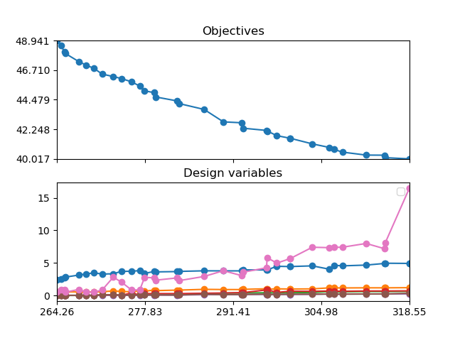
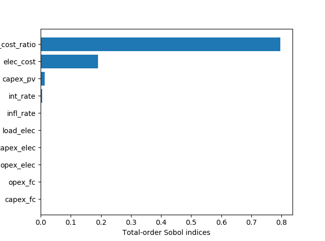
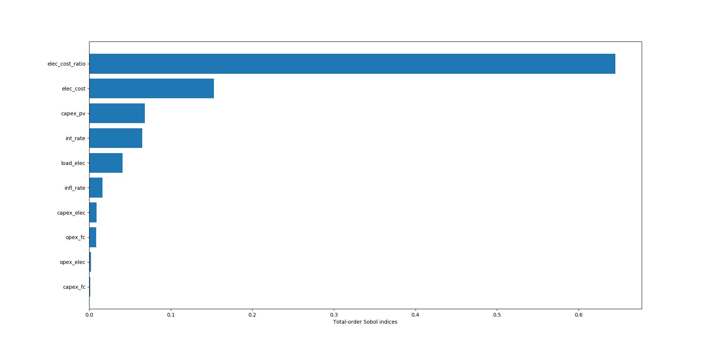
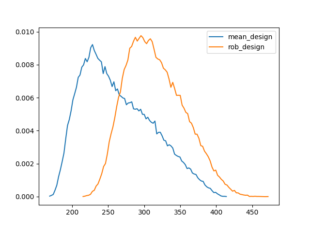

.. _lab:examples:

Examples
========

Power-to-hydrogen-to-power for a grid-connected household
---------------------------------------------------------

In this first example, a robust design optimization is performed on a grid-connected household in Brussels, supported by a photovoltaic-hydrogen system.
The hydrogen energy system consists of an electrolyzer stack, hydrogen storage tank and fuel cell stack.
To optimize the system, 7 design variables are considered: the photovoltaic array capacity, electrolyzer stack capacity, fuel cell stack capacity, 
hydrogen tank capacity and the DC-DC converter capacities of the photovoltaic array, electrolyzer stack and fuel cell stack. 
The mean and standard deviation of the Levelized Cost Of Electricity (LCOE) are selected as objectives.
The CAPEX, OPEX, replacement cost and lifetime of the components are considered uncertain, as well as the wholesale electricity price, electricity demand,
interest rate and inflation rate. A detailed illustration of the energy system model and the stochastic space is provided in :ref:`lab:pvh2model`. 

The design space and stochastic space are defined in :file:`design_space` and :file:`stochastic_space`, respectively. These files are located in
the case folder :file:`CASES\\PV_H2`. Detailed information on characterizing these files is available in :ref:`lab:ssdesignspace` and in :ref:`lab:ssstochastic_space`, respectively.

The system is modelled in the module :py:mod:`pv_h2_lib`, where the :py:class:`ReadData` and :py:class:`Evaluation` classes provide methods to import 
the climate data and to evaluate the LCOE for a system design, respectively. The Python wrapper :py:mod:`case_description` enables to store the climate data
and to couple the design evaluation to the optimization and uncertainty quantification algorithms. Detailed information on the structure of :py:mod:`case_description`
is provided in :ref:`lab:wrapper`.   

Stochastic dimension reduction
^^^^^^^^^^^^^^^^^^^^^^^^^^^^^^

The system is characterized with 27 uncertain parameters, which results in 56, 812 and 8120 model evaluations 
to construct a PCE with a maximum polynomial degree of 1, 2 and 3, respectively.
First, PCEs are constructed for a representative set of design samples to determine the required LOO error (see :ref:`lab:detpolorder` for additional information)::

    In [1]: import rheia.UQ.uncertainty_quantification as rheia_uq
    In [2]: import multiprocessing as mp

    In [2]: case = 'PV_H2'
	
    In [3]: var_dict = rheia_uq.get_design_variables(case)

    In [4]: X = rheia_uq.set_design_samples(var_dict, 35)

    In [5]: for iteration,x in enumerate(X):
      ....:     rheia_uq.write_design_space(case, iteration, var_dict, x)
      ....:     dict_uq = {'case':                  case,
      ....:                'n jobs':                int(mp.cpu_count()/2),
      ....:                'pol order':             1,
      ....:                'objective names':       ['lcoe','ssr'],
      ....:                'objective of interest': 'lcoe',
      ....:                'results dir':           'sample_%i' %iteration      
      ....:               }   
      ....:     rheia_uq.run_uq(dict_uq, design_space = 'design_space_%i' %iteration)

The worst-case LOO error over the design samples set is determined::

    In [6]: import rheia.POST_PROCESS.lib_post_process as rheia_pp

    In [7]: my_post_process = rheia_pp.post_process(case)

    In [7]: pol_order = 2

    In [19]: my_post_process_uq = rheia_pp.post_process_uq(my_post_process, pol_order)

    In [8]: result_dirs = ['sample_%i' %i for i in range(35)]

    In [9]: objective = 'lcoe'

    In [9]: loo = [0]*35

    In [11]: for index,result_dir in enumerate(result_dirs):
       ....:     loo[index] = my_post_process_uq.get_LOO(result_dir, objective))
       ....: print(max(loo))

The worst-case LOO error for a polynomial degree of 1 is equal to 0.061. 
The same procedure is repeated for a polynomial degree of 2, which leads to a worst-case LOO error of 0.006.
Using this polynomial degree, the stochastic dimension is reduced, to increase the computational efficiency of the robust optimization procedure::

	In [12]: my_post_process_uq.get_max_sobol(result_dirs,objective,threshold=1./14.)	

The significant Sobol' indices result in the following reduced :file:`stochastic_space`::

	load_elec       absolute Uniform 0.22
	elec_cost       absolute Uniform 15.5
	elec_cost_ratio absolute Uniform 0.1
	capex_pv        absolute Uniform 175
	capex_elec      absolute Uniform 350
	opex_elec       absolute Uniform 0.01
	capex_fc        absolute Uniform  450
	opex_fc         absolute Uniform  0.045
	int_rate        absolute Uniform 0.02
	infl_rate       absolute Uniform 0.01

robust design optimization
^^^^^^^^^^^^^^^^^^^^^^^^^^

With the stochastic dimension reduced, the robust design optimization is initiated for a population of 35 samples
and a computational budget of 1155000 model evaluation (i.e. at least 250 generations)::

    In [13]: import rheia.OPT.optimization as rheia_opt

    In [14]: dict_opt = {'case':                  'PV_H2',
       ....:             'objectives':            {'ROB': (-1,-1)}, 
       ....:             'stop':                  ('BUDGET', 1155000),
       ....:             'n jobs':                int(mp.cpu_count()/2), 
       ....:             'population size':       35,
       ....:             'pol order':             2,
       ....:             'objective names':       ['lcoe','ssr'],
       ....:             'objective of interest': ['lcoe'],
       ....:             'results dir':           'run_1',
       ....:            }

    In [15]: rheia_opt.run_opt(dict_opt)

More information on setting the NSGA-II parameters are illustrated in :ref:`lab:choosepop` and on the robust optimization procedure in :ref:`lab:optimization`. 
The Pareto front can be initiated as follows::

    In [7]: my_opt_plot = rheia_pp.post_process_opt(my_post_process, False, 'ROB')

    In [8]: y,x = my_opt_plot.get_fitness_population('run_1')

With the information on the objectives (`y`) and on the population (`x`),
the results can be plotted:

The Pareto front illustrates a trade-off between minimizing the LCOE mean and LCOE standard deviation. This means that no single design exists
that simulateounsly achieves the minimum LCOE mean and minimum LCOE standard deviation. When zooming in on the design variables,
a gain in robustness is achieved by increasing the system component capacities. To illustrate, the optimized LCOE mean design
consists of a :math:`2.5~\mathrm{kW}_\mathrm{p}` photovoltaic array, while the robust design consists of 
a :math:`4.9~\mathrm{kW}_\mathrm{p}` photovoltaic array with a :math:`1.2~\mathrm{kW}` DC-DC converter, 
a :math:`598~\mathrm{W}` electrolyzer stack with a :math:`684~\mathrm{W}` DC-DC converter, 
a :math:`232~\mathrm{W}` fuel cell stack with a :math:`224~\mathrm{W}` DC-DC converter and 
a :math:`8~\mathrm{kWh}` hydrogen storage tank.

Global sensitivity analysis on relevant designs
^^^^^^^^^^^^^^^^^^^^^^^^^^^^^^^^^^^^^^^^^^^^^^^

In the final section, uncertainty quantification is performed on the optimized mean design
and robust design. First, the design variables are modified into model parameters to perform UQ in :file:`design_space`.
For the optimized mean design, this leads to::

	n_pv        par 2.45  
	n_dcdc_pv   par 0.55
	n_elec      par 1e-8
	n_dcdc_elec par 1e-8
	n_fc        par 1e-8
	n_dcdc_fc   par 1e-8
	n_tank      par 1e-8

The resulting Sobol' indices indicate that for the mean design, due to the limited photovoltaic array capacity and no energy storage,
the main drivers of the LCOE uncertainty are the parameters related to the grid electricity price:

Alternatively, the robust design has an increased renewable energy system capacity, including energy storage in the form of hydrogen::

	n_pv        par 4.952
	n_dcdc_pv   par 1.17
	n_elec      par 0.598
	n_dcdc_elec par 0.684
	n_fc        par 0.232
	n_dcdc_fc   par 0.225
	n_tank      par 8.06

In this case, the uncertainty on the demand, interest rate and capex of the photovoltaic array gain importance:

Comparing the probability density functions on the LCOE for both design illustrates an overlap. For the robust design,
the mean is clearly higher, but due to the smaller standard deviation, the probability density function has a slightly smaller width: 

   

