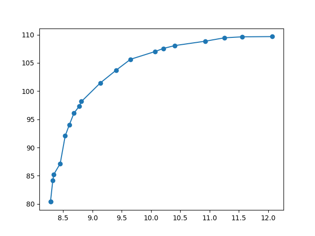
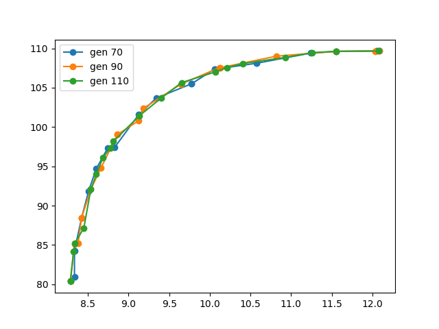
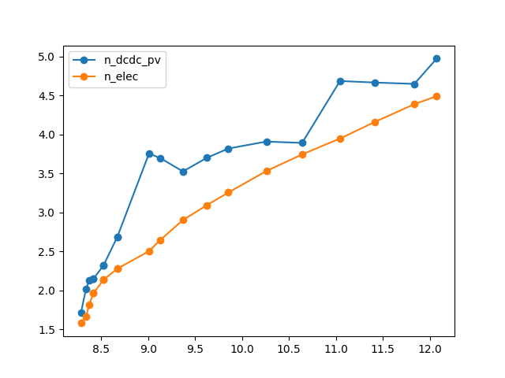

.. _lab:tutorial:

Tutorial
========

In this tutorial, the deterministic optimization, robust optimization and uncertainty quantification procedure
is applied on a photovoltaic-electrolyzer system. 

Photovoltaic-electrolyzer model characterization
------------------------------------------------

The system model evaluates the levelized cost of hydrogen and hydrogen production of a photovoltaic array coupled to an electrolyzer stack. 
This coupling is realised through DC-DC converters. Additional details on the system operation are presented in :ref:`lab:pvelectrolyzermodel`.

The system model information is collected in a case folder :file:`PV_ELEC`, which is located in the folder that contains all the cases (:file:`CASES`).
	
The directory structure of :file:`PV_ELEC` looks as follows::

    PV_ELEC
      design_space
      stochastic_space
      pv_electrolyzer_lib.py
      case_despcription.py

where :file:`design_space` characterizes the design variables and model parameters, 
:py:mod:`pv_electrolyzer_lib` is the module that defines and evaluates the system model
and :py:mod:`case_description.` is the module importing the design space and calling the system model.
An optional file is :file:`stochastic_space`, which describes the uncertainty on stochastic parameters.
This file is required only to perform uncertainty quantification and robust optimization.

The :file:`design_space` file includes information on all the parameters and variables that require a quantification from outside the system model. 
For the photovoltaic-electrolyzer model, 18 parameters require a quantification, including the capacity, CAPEX, OPEX and efficiency of the components. 
Depending on the procedure, the parameters are considered as a parameter or a variable
(e.g. during uncertainty quantification, only model parameters are considered, while during optimization, the capacities are design variables). 
More information on the :file:`design_space` characterization can be found in :ref:`lab:ssdesignspace`.

The Python wrapper :py:mod:`case_description` module couples the system model to the optimization and uncertainty quantification algorithms.
More information on the Python wrapper is discussed in :ref:`lab:wrapper`. 
First, the photovoltaic-electrolyzer module is imported:: 

    import pv_electrolyzer_lib as pv_elec

Additionally, datasets and constants that remain constant during the multiple model evaluations are defined in the module :py:meth:`set_params()`
and stored in the instance variable `self.params`.
In this tutorial, only the solar irradiance dataset is loaded for Brussels, using the :py:meth:`load_climate()` method from :py:class:`ReadData` in the :py:mod:`pv_electrolyzer_lib` module::
    	
    def set_params(self):

        filename_climate = os.path.join(os.path.abspath(
                                        os.path.join(self.path,
                                                     os.pardir)),
                                        'DATA',
                                        'climate',
                                        'climate_Brussels.csv')

        my_data = pv_elec.ReadData(filename_climate)
        G = my_data.load_climate()

        self.params = [G]

The model is evaluated in the method :py:meth:`evaluate()`. The method's argument is an enumerate object `x` which represents the input sample. 
The input sample (`x[1]`) is integrated in a dictionary in the method :py:meth:`convert_into_dictionary()`, 
where the sample values are linked with the corresponding parameter name in each dictionary item. 
This input sample dictionary and the list with fixed datasets `self.params` are the arguments 
for the instantiation operator of :py:class:`pv_elec.Evaluation`. The new class instance is saved as an object in `my_evaluation`.   
The :py:meth:`evaluate()` method is called to return the objective values.
These objective values are stored in the local variables `lcoh` and `mh2` and returned to the optimizer or uncertainty quantification algorithm. This process in the :py:meth:`evaluate` method is presented as follows:: 

    def evaluate(self, x):

		x_dict = self.convert_into_dictionary(x[1])

		arguments = self.params + [x_dict]

		my_evaluation = pv_elec.Evaluation(*arguments)

		my_evaluation.evaluation()

        lcoh, mh2 = my_evaluation.lcoh, my_evaluation.m_h2

		return lcoh, mh2

deterministic design optimization
---------------------------------

For a fixed photovoltaic array, the capacity of the electrolyzer stack and the capacity of the DC-DC converter can be designed 
to optimize the Levelized Cost Of Hydrogen (:math:`\mathrm{LCOH}`) and hydrogen production :math:`\dot{m}_{\mathrm{H}_2}`.
Therefore, in the :file:`design_space` file, the capacities for these components are characterized as design variables::

	n_dcdc_pv   var 1e-8 10
	n_elec      var 1e-8 10

With this characterization, the optimizer can configurate design samples with values between :math:`0~\mathrm{kW}` and :math:`10~\mathrm{kW}` for the DC-DC converter and electrolyzer stack. 
The photovoltaic array is fixed at :math:`5~\mathrm{kW}_\mathrm{p}`, and the remaining deterministic parameters are predefined in the :file:`design_space` file.
Detailed information on constructing this file is available in :ref:`lab:ssdesignspace`.

To perform a deterministic optimization, the optimization dictionary has to be completed. 
The detailed explanation for each item is described in :ref:`lab:optimization`.
In this tutorial, the deterministic optimization is imported and the optimization dictionary is configured as follows::

    In [1]: import rheia.OPT.optimization as rheia_opt
    In [2]: import multiprocessing as mp

    In [3]: dict_opt = {'case':                'PV_ELEC',
       ...:             'objectives':          {'DET': (-1, 1)}, 
       ...:             'stop':                ('BUDGET', 2000),
       ...:             'n jobs':              int(mp.cpu_count() / 2), 
       ...:             'population size':     20,
       ...:             'results dir':         'run_1',
       ...:             }

In the dictionary, the case folder name `PV_ELEC` is provided, followed by the optimization type `DET` and the weigths for both objectives, 
i.e. minimization for the first returned objective `lcoh` and maximization for the second returned objective `mH2`. 
A computational budget of 3000 model evaluations is selected as stopping criterium and the number of available physical cores are used
to parallelize the evaluations. The population contains 30 samples. These samples are generated based on Latin Hypercube Sampling 
and the NSGA-II optimizer is characterized with a crossover probability of 0.9, mutation probability of 0.1 and eta of 0.2.
As Latin Hypercube Sampling is selected for the characterization of the population and the NSGA-II characteristics are equal to
the standard settings, these specific items are not mentioned in the optimization dictionary.  
More information on defining the values for these NSGA-II parameters are illustrated in :ref:`lab:choosepop`. 
Finally, the population and fitness values for each generation are saved in the folder `run_1`. 
To run the optimization, the :py:func:`run_opt` function is called::

    In [4]: rheia_opt.run_opt(dict_opt)
	
When the run is complete (i.e. the computational budget is spent), the results are saved in :file:`RESULTS\\PV_ELEC\\DET\\run_1`.
To plot the objectives and the corresponding inputs in function of the LCOH, a :py:class:`post_process` instance is instantiated first::

	In [4]: import rheia.POST_PROCESS.lib_post_process as rheia_pp

	In [5]: case = 'PV_ELEC'

	In [6]: my_post_process = rheia_pp.post_process(case)

Followed by an :py:class:`optimization_plot` instance which contains specific information on the optimization results::

	In [7]: LIGHT = False

	In [8]: eval_type = 'DET'

	In [10]: my_opt_plot = rheia_pp.post_process_opt(my_post_process, LIGHT, eval_type)

The fitness values and design samples can be plotted for the final generation through the :py:meth:`get_fitness_population()` method::

    In [9]: result_dir = 'run_1'

    In [xx]: y,x = my_opt_plot.get_fitness_population(result_dir)

    In [7]: import matplotlib.pyplot as plt

    In [8]: plt.plot(y[0], y[1], '-o')

    In [8]: plt.show()

    In [9]: for x_in in x:
       ...:	    plt.plot(y[0], x_in, '-o')
       ...: plt.legend(['n_dcdc_pv', 'n_elec'])
       ...: plt.show()

The function enables to print out the Pareto front and the design variables on the same x-axis (LCOH) after 110 generations:

   A trade-off exists between minimizing the LCOH and maximizing the hydrogen production. 
   

     
   The capacities of the system components increases gradually to improve the hydrogen production, at the expense of an increase in LCOH.

Note that due to the crossover and mutation probability being below 1, a new generation does not always contain new design samples.
The old design samples are not evaluated again, which reduces the computation cost for the next generation and thus allows to generate
a higher number of generations (>100) with the computational budget provided.
To analyze the convergence of the Pareto front, generation 70, 90 and 110 are plotted::

    In [8]: legend = []
    In [8]: for i in [70,90,110]:
       ...:     y,x = my_opt_plot.get_fitness_population(result_dir, gen = i)
       ...:     plt.plot(y[0],y[1])
       ...:     legend.append('gen %i' %i)
       ...: plt.legend(legend)
       ...: plt.show()
	

Adding another 4000 model evaluations to the budget, results in a smoother evolution of the design variables in function of LCOH,
but does not affect the outcome of the Pareto front dramatically:

	
Robust design optimization
--------------------------

The robust design optimization procedure simultaneously minimizes the mean and standard deviation of the quantity of interest.
These statistical moments are quantified following the propagation of the input parameter uncertainties.
The stochastic input parameters are characterized in the :file:`stochastic_space` file, which is added to the case folder `PV_ELEC`. 
More information on the construction of :file:`stochastic_space` is found in :ref:`lab:ssstochastic_space`.
In this tutorial, 14 parameters are considered uncertain, for which the uncertainty is characterized by a Uniform distribution with
an absolute range with respect to the mean value::

	sol_irr      absolute Uniform 0.099
	capex_pv     absolute Uniform 175
	opex_pv      absolute Uniform 1.5
	power_tol_pv absolute Uniform 2.5
	capex_elec   absolute Uniform 350
	opex_elec    absolute Uniform 0.01
	repl_elec    absolute Uniform 0.025
	life_elec    absolute Uniform 20000
	eff_elec     absolute Uniform 0.05
	eff_dcdc     absolute Uniform 0.025
	capex_dcdc   absolute Uniform 50
	opex_dcdc    absolute Uniform 0.02
	int_rate     absolute Uniform 0.02
	infl_rate    absolute Uniform 0.01
	
Determination of the polynomial order
^^^^^^^^^^^^^^^^^^^^^^^^^^^^^^^^^^^^^

Based on the PCE trunctation scheme, the number of model evaluations required to construct a PCE for each design sample
corresponds to 30, 240 and 1360 for a maximum polynomial degree of 1,2 and 3, respectively. The polynomial degree
that leads to an accurate expansion is not known a priori and should, therefore, be determined iteratively. 
In a robust optimization framework, the expansion should be sufficiently accurate over the entire design space.
To determine the polynomial order, first a representative set of design samples is constructed using Latin Hypercube Sampling.
Then, a PCE for a specific polynomial degree is constructed for each design sample. 
Finally, the highest Leave-One-Out error from the PCEs is stored. If this error is acceptable, 
the polynomial order is selected for the robust optimization procedure. We refer to :ref:`lab:detpolorder` for more details on the method.

First, the design samples are constructed based on Latin Hypercube Sampling. 30 design samples are selected, based on a rule of thumb that states that
10 samples per design variable are sufficient to evaluate the design space. The functions :py:func:`get_design_variables` and :py:func:`set_design_samples`
are used to store information on the design variables and to generate the samples through Latin Hypercube Sampling, respectively::

	In [1]: import rheia.UQ.uncertainty_quantification as rheia_uq

	In [13]: n_des_var = 20

	In [14]: var_dict = rheia_uq.get_design_variables(case)

	In [15]: X = rheia_uq.set_design_samples(var_dict, n_des_var)

A PCE can be constructed for each design sample. This is performed by constructing :file:`design_space` files through :py:func:`write_design_space` 
-- one for each design sample -- and evaluating the respective uncertainty quantification dictionaries. 
At first, a polynomial degree of 1 is selected for evaluation::

	In [15]: for iteration,x in enumerate(X):
	   ....:     rheia_uq.write_design_space(case, iteration, var_dict, x)
	   ....:     dict_uq = {'case':                  case,
	   ....:                'n jobs':                int(mp.cpu_count()/2),
	   ....:                'pol order':             1,
	   ....:                'objective names':       ['lcoh','mh2'],
	   ....:                'objective of interest': 'lcoh',
	   ....:                'results dir':           'sample_%i' %iteration      
	   ....:               }   
	   ....:     rheia_uq.run_uq(dict_uq, design_space = 'design_space_%i' %iteration)
		
This results in a PCE for each design sample, for which the information is stored in :file:`RESULTS\\PV_ELEC\\UQ`.
To determine the worst-case LOO error for the 20 design samples, a :py:class:`post_process_uq` class object is instantiated, 
followed by the call of the :py:meth:`get_LOO` method::

    In [16]: pol_order = 1

    In [19]: my_post_process_uq = rheia_pp.post_process_uq(my_post_process, pol_order)

    In [8]: result_dirs = ['sample_%i' %i for i in range(20)]

    In [18]: objective = 'lcoh'

    In [9]: loo = [0]*20

    In [11]: for index, result_dir in enumerate(result_dirs):
       ....:     loo[index] = my_post_process_uq.get_LOO(result_dir, objective))
       ....: print(max(loo))
 
For a maximum polynomial order 1, the worst-case LOO error is 0.0379.
Increasing the order to 2 and generating the PCE for the same design samples (i.e. the :file:`design_space` files are not overwritten)
decreases the worst-case LOO error down to 0.0137. Finally, for a maximum polynomial degree of 3, the
worst-case LOO error equals 0.007. However, the gain in accuracy is limited when compared to the increase in computational cost
(1360 model evaluations per design sample to construct the PCE, as opposed to 240 model evaluations for a polynomial degree of 2). 
Therefore, a maximum polynomial degree of 2 is selected for the PCE truncation scheme.

Reducing the stochastic dimension
^^^^^^^^^^^^^^^^^^^^^^^^^^^^^^^^^

Within the current truncation scheme, the number of stochastic parameters and the polynomial order define the number of model evaluations required to construct the PCE.
However, the contribution of each parameter uncertainty to the variance of the quantity of interest is different. 
If the stochastic parameters that contribute little to the output variance are considered deterministic,
the computational efficiency can be improved dramatically, with a negligible loss in accuracy on the statistical moments. 
To determine this contribution, the Sobol' indices for each stochastic parameter are quantified. 
To make sure that the Sobol' index for a specific parameter is negligible over the entire design space, 
the Sobol' indices are quantified for the representative set of design samples. 
The highest Sobol' index found for each stochastic parameter over the set of design samples
determines the Sobol' index on which the decision is made in this conservative approach.
During the determination of the PCE polynomial degree in the previous section, 
the Sobol' indices for a representative set of design samples has already been evaluated.
The corresponding Sobol' indices are saved for each sample in the folders :file:`sample_0`, :file:`sample_1`,..., :file:`sample_29`. 
The stochastic parameters with negligible effect are printed through the following commands, 
where a threshold for the Sobol' index is set at 1/14 (= 1/number of uncertain parameters)::

	In [21]: pol_order = 2

	In [22]: my_post_process_uq = rheia_pp.post_process_uq(my_post_process,pol_order)

	In [12]: my_post_process_uq.get_max_sobol(result_dirs,objective,threshold=1./14.)	

	significant Sobol indices:
	capex_pem: 0.484103
	int_rate: 0.297882
	sol_irr: 0.152352
	eff_pem: 0.128252
	opex_pem: 0.089568
	infl_rate: 0.082414
	capex_pv: 0.335303
	capex_dcdc: 0.137550

	negligible Sobol indices:
	life_pem: 0.026493
	eff_dcdc: 0.016157
	power_tol_pv: 0.010049
	opex_dcdc: 0.049349
	opex_pv: 0.004468
	repl_pem: 0.001366
  
6 out of 14 stochastic parameters have a maximum Sobol' index below the threshold, 
which indicates that these parameters can be considered deterministic without losing significant statistical accuracy on the LCOH.
This reduction results in a decrease of 63% in computational cost, as only 90 model evaluations are required to 
construct a PCE for 8 uncertain parameters in the current truncation scheme, as opposed to 240 model evaluations with 14 uncertain parameters. 
Thus, the 6 parameters with negligible contribution can be removed from :file:`stochastic_space`::

	sol_irr      absolute Uniform 0.099
	capex_pv     absolute Uniform 175
	capex_pem    absolute Uniform 350
	opex_pem     absolute Uniform 0.01
	eff_pem      absolute Uniform 0.05
	capex_dcdc   absolute Uniform 50
	int_rate     absolute Uniform 0.02
	infl_rate    absolute Uniform 0.01

Run robust design optimization
^^^^^^^^^^^^^^^^^^^^^^^^^^^^^^

With the design variables, model parameters, uncertainties and maximum polynomial degree characterized, the robust design optimization can be performed.
Again, a population of 30 samples is selected. With 90 model evaluations required per design sample, a computational budget of 270000 is selected to reach at least 150 generations.
The optimization dictionary is configurated as follows::

    In [24]: dict_opt = {'case':                  'PV_ELEC',
       ....:             'objectives':            {'ROB': (-1, -1)}, 
       ....:             'stop':                  ('BUDGET', 270000),
       ....:             'n jobs':                int(mp.cpu_count()/2), 
       ....:             'population size':       20,
       ....:             'pol order':             2,
       ....:             'objective names':       ['lcoh','mh2'],
       ....:             'objective of interest': ['lcoh'],
       ....:             'results dir':           'run_1',
       ....:            }

Followed by the command to initiate the robust design optimization::

    In [25]: rheia_opt.run_opt(dict_opt)

The results show a single design, which indicates that there is no trade-off between minimizing the LCOH mean and minimizing the LCOH standard deviation:
A PV DC-DC converter of :math:`1.47 \mathrm{kW}` and an electrolyzer array of :math:`1.30 \mathrm{kW}_\mathrm{p}`. The design achieves an
LCOH mean of :math:`8.41 \mathrm{euro} / \mathrm{kg}_{\mathrm{H}_2}` and a LCOH standard deviation of 1.03 \mathrm{euro} / \mathrm{kg}_{\mathrm{H}_2}. 

Uncertainty Quantification
--------------------------

Following the robust design optimization, a single optimized design is characterized that optimizes both mean and standard deviation of the LCOH.
The Sobol' indices for this design can illustrate the main drivers of the uncertainty on the LCOH, which can provide guidelines 
to effectively reduce the uncertainty by gathering more information on the dominant parameters.
The design is specified in :file:`design_space`, by replacing the design variable ranges with the specified capacities::

	n_dcdc_pv   par 1.47
	n_elec      par 1.30

The uncertainty quantification dictionary is characterized as follows::

    In [26]: dict_uq = {'case':                  'PV_ELEC',
       ....:            'n jobs':                int(mp.cpu_count()/2),
       ....:            'pol order':             2,
       ....:            'objective names':       ['lcoh','mh2'],
       ....:            'objective of interest': 'lcoh',
       ....:            'draw pdf cdf':          [True, 1e5],
       ....:            'results dir':           'opt_design'      
       ....:           }  

And the UQ is started with :py:func:`run_uq`::

    In [27]: rheia_uq.run_uq(dict_uq)

The resulting Sobol' indices can be plotted in a bar chart. The process is similar to the determination of the worst-case LOO error,
but the :py:meth:`get_sobol` method is used instead::

	In [30]: result_dir = 'opt_design'

    In [14]: names, sobol = my_post_process_uq.get_sobol(result_dir, objective)

    In [14]: plt.bar(names, sobol)

    In [14]: plt.show()

The Sobol' indices illustrate that the uncertainty on the interest rate and the investment cost of the PV array and electrolyzer stack
dominate the uncertainty on the LCOH. 

Finally, the probability density function is plotted with the :py:meth:`get_pdf` method::

    In [15]: x,y = my_post_process_uq.get_pdf(result_dir,objective)

    In [14]: plt.plot(x, y)

    In [14]: plt.show()

.. figure:: tut_pdf.png
   :width: 80%
   :align: center

    

